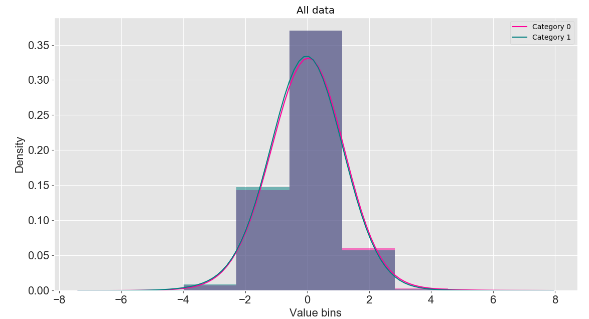

# SIFS User Manual

## 1 Introduction

SIFS is an advanced toolbox based on swarm intelligence for feature selection in high-dimensional biomedical datasets. Specifically, SIFS is a machine learning platform with a graphical interface that enables the construction of automated machine learning pipelines for computational analysis and prediction using locally uploaded high-dimensional biomedical datasets. SIFS provides four main modules, including feature selection and normalization, clustering and dimensionality reduction, machine learning and classification, for biologists and bioinformaticians to perform multiple-choice feature engineering and analysis, machine learning algorithm construction, performance evaluation, statistical analysis, and data visualization without the need for additional programming. In terms of feature selection, SIFS integrates 55 swarm intelligence algorithms and 5 traditional feature selection algorithms; in machine learning, SIFS integrates 21 machine learning algorithms (including 12 traditional classification algorithms, two ensemble learning frameworks, and seven deep learning methods). Additionally, SIFS's user-friendly GUI (Graphical User Interface) facilitates smooth analysis for biologists, significantly improving efficiency and user experience compared to existing pipelines.

## 2 Installation and Running of SIFS

### 2.1 Installation

SIFS is an open-source toolbox based on Python, designed to run within a Python environment (Python 3.6 or higher) and is compatible with multiple operating systems such as Windows, Mac, and Linux. Before installing and running SIFS, all dependencies should be installed within the Python environment, including PyQt5, qdarkstyle, numpy (1.18.5), pandas (1.0.5), threading, sip, datetime, platform, pickle, copy, scikit-learn (0.23.1), math, scipy (1.5.0), collections, itertools, torch (≥1.3.1), lightgbm (2.3.1), xgboost (1.0.2), matplotlib (3.1.1), seaborn, joblib, warnings, random, multiprocessing, and time. For convenience, we strongly recommend users to install the Anaconda Python environment on their local machines, which can be freely downloaded from https://www.anaconda.com/. Detailed steps for installing these dependencies are as follows:

1) Download and install the Anaconda platform (Conda can create and manage virtual environments, allowing users to use different Python versions and dependencies in different projects, ensuring isolation and independence between projects): The download link is https://www.anaconda.com/products/individual.

2) Download and install PyTorch (PyTorch is an open-source deep learning framework that provides flexible and efficient tools for building and training deep neural network models). For PyTorch installation, please refer to https://pytorch.org/get-started/locally/.

3) Install necessary Python packages and dependencies such as lightgbm and qdarkstyle.

### 2.2 Running

To run SIFS, navigate to the installation folder of SIFS and execute the 'main.py' script as follows:

```sh
python main.py
```

Once SIFS is launched, the interface will display as shown in Figure 1.

<div align=center></div>

<div align=center><b>Figure 1: Main interface of SIFS</b></div>

## 3 The workflow of SIFS

Here, we provide a step-by-step user guide to demonstrate the workflow of the SIFS toolkit by running examples provided in the "examples" directory. The four fundamental functionalities of SIFS, including feature extraction, feature analysis (clustering and dimensionality reduction), predictor construction, and data/result visualization, are designed and implemented.

<div align=center><b>Table 1: Three fundamental modules of SIFS</b></div>

| **Module name**                    | **Function**                                                 |
| ---------------------------------- | ------------------------------------------------------------ |
| Feature Normalization/Selection    | 1) 55 population intelligent feature algorithms + 5 traditional feature selection algorithms<br/>2) 2 feature normalization methods |
| Cluster / Dimensionality Reduction | 1) 10 clustering algorithms<br/>2) 3 three-dimensional dimensionality reduction algorithms |
| Machine Learning                   | 21 machine learning algorithms (12 traditional classification algorithms, 2 ensemble learning frameworks, and 7 deep learning methods) |
| Data visualization                 | Data visualization (scatter plots for clustering and dimensionality reduction results, histograms and kernel density plots for data distribution, ROC and PRC curves for performance evaluation) |

## 4 Input format of SIFS

For feature analysis and predictor construction, SIFS supports four file formats: LIBSVM format, Comma-Separated Values (CSV), Tab-Separated Values (TSV), and Waikato Environment For Knowledge analysis (WEKA) format. For LIBSVM, CSV, and TSV formats, the first column must be the sample label. For examples of these file formats, please refer to the "data" directory of the software.

## 5 Introduction to SIFS modules

SIFS is an advanced swarm intelligence-based toolbox for feature selection on high-dimensional biomedical datasets. It facilitates four primary functionalities: feature selection, feature analysis, predictor construction, and data/result visualization. Within the SIFS module, there are three panels:

- "Feature Normalization/Selection" is utilized for feature selection and normalization algorithms.
- The "Cluster/Dimensionality Reduction" panel is dedicated to feature dimensionality reduction and clustering.
- The "Machine Learning" panel is used for building prediction models.

### 5.1 Feature selection/normalization

The panel comprises 60 feature selection algorithms, including 55 swarm intelligence-based feature algorithms and 5 traditional feature selection algorithms, for feature selection. Additionally, it offers 2 feature normalization methods for data preprocessing.

#### 5.1.1 Upload data file

Click on the "Open" button in the "Feature Normalization/Selection" panel, and select the data file (for example: "test_datas.csv" in the "data" directory of the iLearnPlus package).

#### 5.1.2 Select the feature selection algorithm

Select the feature selection algorithm under the "Feature selection data" column (taking AOA as an example), and set the corresponding parameters in the parameter dialog box (using default parameters here). Parameters include common parameters and private parameters (each feature selection algorithm has its specific parameters, as shown in Figure 2).
SIFS currently supports 17 basic models for evaluating and optimizing feature selection algorithms, including Logistic Regression, K-Nearest Neighbors, and XGBoost.
In the "Parameters" section, information such as processing type (feature selection or normalization), selected algorithm, and base model (used for feature selection optimization) will be displayed.

<div align=center></div>

<div align=center><b>Figure 2: Parameter settings for AOA</b></div>

#### 5.1.3 Running algorithm

Click the "Start" button to compute the features after feature selection. The data before feature selection and its graphical representation will be displayed in the "Origin Data" and "Origin Data distribution" panels, respectively. The data and graphical representation after feature selection will be shown in the "Data" and "Data distribution" panels, respectively. Histograms and kernel density plots are used here to display the distribution of feature encodings. Additionally, the loss curve of model optimization during the feature selection process will be shown in the "Loss Curve" panel.

#### 5.1.4 Save the results and visualizations

Click the "Save" button to save the generated data after feature selection. SIFS supports saving the computed features in four formats: LIBSVM, CSV, TSV, and WEKA, facilitating direct use of these features in subsequent analysis, predictor construction, etc. Additionally, SIFS provides the TSV_1 format, which includes sample and feature labels.
Moreover, all plots in SIFS are generated using the matplotlib library and can be saved in various image formats such as PNG, JPG, PDF, TIFF, etc.

<div align=center></div>

<div align=center><b>Figure 3: An example of using the Feature Normalization/Selection module for feature selection</b></div>

#### 5.1.5 Supplementary Remarks

**Note 1**: In this module, besides supporting uploading data from local files, you can also choose to use dimensionality-reduced data obtained from the "Cluster/Dimensionality Reduction" module for feature selection.

<div align=center></div>

<div align=center><b>Figure 4: Obtaining dimensionality-reduced data from Dimensionality Reduction for feature selection</b>b</div>

**Note 2**: The loss curve of model optimization during the feature selection process will be displayed in the "Loss Curve" panel, as shown below:

<div align=center></div>

<div align=center><b>Figure 5: Loss Curve Over Epochs</b>
</div>

**Note 3**: In addition to being used for feature selection, this module can also be used for feature normalization, as shown in the following figure:

<div align=center></div>

<div align=center><b>Figure 6: Histogram and kernel density plot after feature normalization</b></div>

### 5.2 Feature Analysis (Feature Clustering/Dimensionality Reduction)

SIFS provides various options to facilitate feature analysis, including 10 feature clustering methods, 3 dimensionality reduction methods, 2 feature normalization methods, and 60 feature selection methods. In the SIFS module, the "Cluster/Dimensionality Reduction" panel is used to deploy clustering and dimensionality reduction algorithms, while the "Feature Normalization/Selection" panel is used to implement feature normalization and selection functionalities. Here, we take clustering as an example:

#### 5.2.1 Import data

There are two methods to load data for analysis:

1) Open an encoded file.
2) Select data generated from other panels.

Here, we will load data from a file. Click the "Open" button and select the "test_datas.csv" file in the "data" directory.

#### 5.2.2 Select the analysis algorithm and set the corresponding parameters

Here, we select the "GM" clustering algorithm as a demonstration. We set the number of clusters to 5. To visualize the clustering results, we will reduce the dimensionality of the clustered data to two dimensions for visualization.

#### 5.2.3 Running algorithm

Click the "Start" button to begin the analysis process. The clustering results and graphical representations will be displayed in the "Result" and "Scatter plot" panels, respectively. Here, we use a scatter plot to visualize the clustering results.

#### 5.2.4 Save the results and visualizations

Click the "Save" button to save the generated clustering results.

<div align=center></div>

<div align=center><b>Figure 7: An example of using the SIFS module to implement clustering algorithms (using the GM algorithm as an example)</b></div>

#### 5.2.5 Supplementary statement

In addition to being used for feature clustering, this module can also be used for feature dimensionality reduction. Here, we will use PCA to reduce the original data to 3 dimensions (the visualization results will be displayed in 2 dimensions) as shown below:

<div align=center></div>

<div align=center><b/>Figure 8: Scatter plot after PCA dimensionality reduction</b></div>

### 5.3 Predictor Construction

SIFS offers 12 traditional classification algorithms, two ensemble learning frameworks, and seven deep learning methods. The implementation of these algorithms in SIFS is based on four third-party machine learning platforms, including scikit-learn (3), XGBoost (4), LightGBM (5), and PyTorch (6). Among them, the CNN algorithm serves as the core machine learning algorithm.

#### 5.3.1 Import data

There are two methods to load data for analysis:

1) Load data files from local storage.
2) Select data generated from other panels.

Here, we will select to load training and testing data from the "Feature Normalization/Selection" panel.

#### 5.3.2 Select the machine learning algorithm and configure the parameters

Select "Random Forest" and use the default parameter values.

<div align=center></div>

<div align=center><b>Figure 9: Parameters of the RF algorithm</b></div>

####  5.3.3 Set up k-fold cross-validation

Set k to 5

#### 5.3.4 Run the algorithm

Click the "Start" button to initiate the analysis process. The evaluation metrics for prediction scores, k-fold cross-validation, independent testing, as well as ROC and PRC curves, will be displayed.

#### 5.3.5 Save the results and visualizations

The predictor construction module of SIFS supports saving files such as indicator scores, evaluation metrics, and trained models.

<div align=center></div>

<div align=center><b>Figure 10: Results saved</b></div>

<div align=center></div>

<div align=center><b>Figure 11: An example of using the CNN algorithm to build a model in SIFS</b></div>

### 6 Performance evaluation strategies in SIFS

As described in this article, SIFS supports both binary classification tasks and multi-class classification tasks. For binary classification problems, SIFS supports 8 commonly used metrics, including sensitivity (Sn), specificity (Sp), accuracy (Acc), Matthews correlation coefficient (MCC), precision, f1-score, area under the ROC curve (AUROC), and area under the precision-recall curve (AUPRC). The definitions of Sn, Sp, Acc, MCC, Precision, and F1-score are as follows:
```math
\begin{gathered}
S n=\frac{T P}{T P+F N}, \\\\
S p=\frac{T N}{T N+F P}, \\\\
A c c=\frac{T P+T N}{T P+T N+F P+F N}, \\\\
M C C=\frac{T P \times T N-F P \times F N}{\sqrt{(T P+F P)(T P+F N)(T N+F P)(T N+F N)}}, \\\\
\text { Precision }=\frac{T P}{T P+F P}, \\\\
F 1=2 \times \frac{\text { Precision } \times \text { Recall }}{\text { Precision }+ \text { Recall }},
\end{gathered}
```
Where TP, FP, TN, and FN represent the quantities of true positives, false positives, true negatives, and false negatives, respectively. The values of AUROC and AUPRC, calculated based on the Receiver-Operating Characteristic (ROC) curve and Precision-Recall curve, respectively, range from 0 to 1. Higher values of AUROC and AUPRC indicate better predictive performance of the model.

For multi-class classification tasks, performance is typically evaluated using accuracy (Acc), which is defined as:
```math
A c c=\frac{T P(i)+T N(i)}{T P(i)+T N(i)+F P(i)+F N(i)}
```
Where TP(i), FP(i), TN(i), and FN(i) represent the quantities of samples (numerator) correctly predicted as class i, the total number of class i samples predicted as any other class, the total number of samples correctly predicted as non-class i, and the total number of non-class i samples predicted as class i, respectively.

### 7 Source Code location Guide

To facilitate users, we provide a brief guide that users can use to identify the location of the given part of the source code in SIFS. The table is as follows:

<div align=center><b>Table 2: Source Code Location Guide for SIFS

| Main Directory | Subdirectory                   | Content                                                      |
| -------------- | ------------------------------ | ------------------------------------------------------------ |
| Data           | CSV and other file formats     | Example files stored in this directory                       |
| Document       | SIFS_manual.pdf                | User manual                                                  |
| images         | Image Files                    | Icons and image files                                        |
| losses         | jFitnessFunction.py            | Fitness functions for feature selection optimization         |
| models         | Model files ending with ".pkl" | By default, models will be saved in this directory           |
| util           | Feature_selection              | 55 population intelligence feature selection algorithms      |
|                | DataAnalysis.py                | Classes for feature analysis, including clustering, feature normalization, selection, and dimensionality reduction |
|                | EvaluationMetrics.py           | Classes for computing evaluation metrics                     |
|                | InputDialog.py                 | GUI classes for all dialogs for parameter settings           |
|                | MachineLearning.py             | Classes for model construction, including all traditional machine learning algorithms |
|                | MCL.py                         | Markov clustering algorithm                                  |
|                | ModelMetrics.py                | Classes for storing evaluation metric data and data for plotting ROC and PRC curves |
|                | Nets.py                        | Architecture for storing deep learning algorithms            |
|                | PlotWidgets.py                 | GUI classes for plotting, such as ROC, PRC curves, scatter plots, and kernel density |
|                | TableWidget.py                 | GUI for table display                                        |
| Main.py        | --                             | GUI for launching the program                                |
| SIFS.py        | --                             | GUI for the SIFS module                                      |

